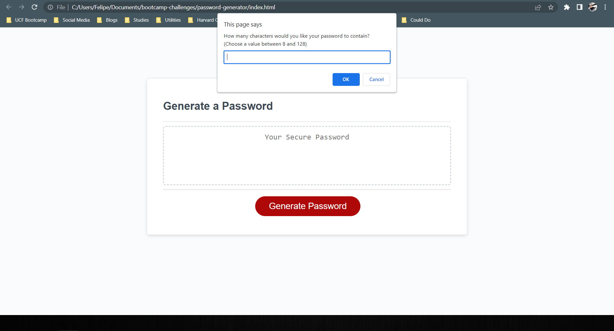
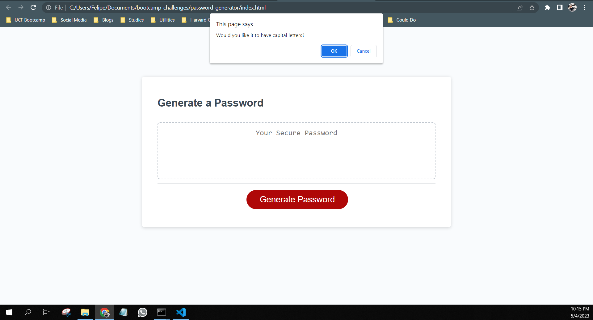
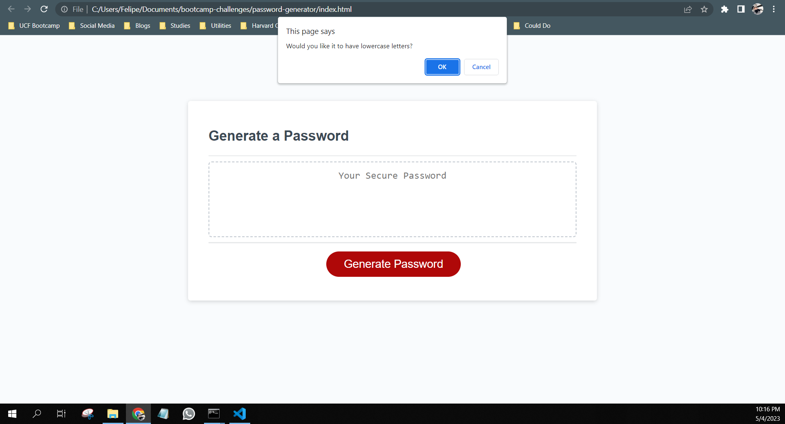
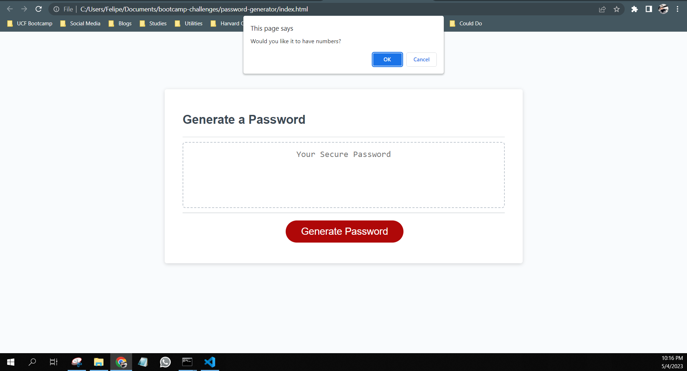
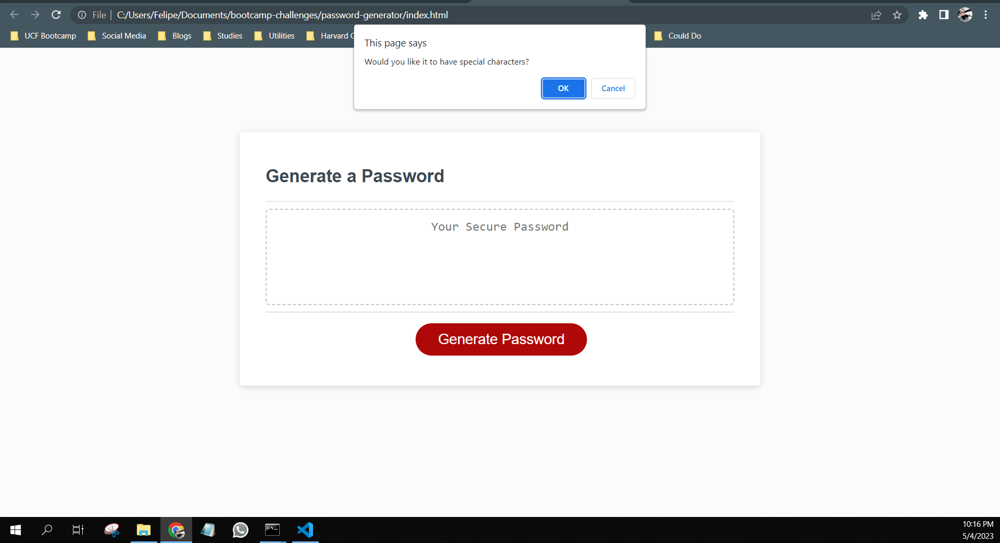
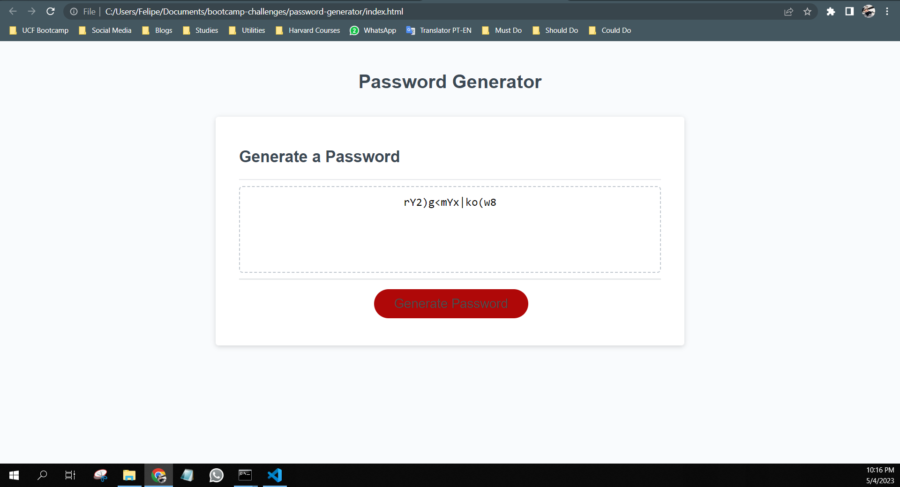

# Password Generator

## Description

In this project we had the challenge of making a secure password generator using HTML, CSS and mainly JavaScript. We can choose to generate a password between 8 and 128 characters containing upper and lower case letters, numbers and special characters.

## Deployed Application Link

https://usflfelipe.github.io/password-generator/

## Screenshot

## Contribuitions

* Starter code created by UCF Boot Camp
* Code completed by Felipe Ursini
* I worked in this code with my peer Renan Massini